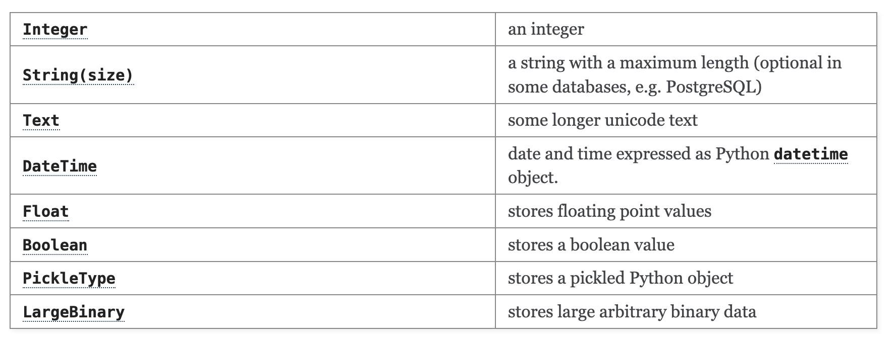

# Table creation/models

## Defining Models

### Where to start
First of all, type this line in your terminal to do the installation:
```
pip install -U Flask-SQLAlchemy
```

To create tables, we need to start with the object model and to generate the tables from it.
In this case, we will use SQLAlchemy, which is a python SQL toolkit and Object Relational Mapper that gives application developers the full power and flexibility of SQL.

#### Basic Requirements
Create a python file named “model.py”

Import library that is required:
~~~python
from flask import Flask
from flask_sqlalchemy import SQLAlchemy
~~~

Next step, we need a base class to inherit from, which will be used for all your models, called db.Model. This will be stored on the SQLAlchemy instance that we should add

~~~python
app = Flask(__name__)
app.config['SQLALCHEMY_DATABASE_URI'] = 'sqlite:////tmp/test.db'
db = SQLAlchemy(app)
~~~
in our model.py file. Then we can use db.Model when we create our table

### Declaring Models

#### Declare Class
To create a table, we will need to declare a class, the class name will be converted to lowercase as the table name“__tablename__”. You can define your own table name if you wish “__tablename__ = ‘comment’”

~~~python
class Comment(db.Model):
~~~
In this case, out table will be "__comment__"

#### Adding Column
Then we will define our columns in the table with ```db.Column()```

For example, we want to add the column whose name is "id", and the type of this column is Integer, we will also want to add the creator_id of the comment and the post_id that the comment is posted to, we will add these in our file
~~~python
class Comment(db.Model):
    id = db.Column(db.Integer)

    creator_id = db.Column(db.Text)

    post_id = db.Column(db.Integer)
~~~
Here are some common types for the column:


If we want to set the id as the primary key of the table, then we add “primary_key = True” as our second argument
~~~python
class Comment(db.Model):
    id = db.Column(db.Integer, primary_key=True)

    creator_id = db.Column(db.Text)

    post_id = db.Column(db.Integer)
~~~

NOT NULL in ORM:
Instead of NOT NULL, we use “nullable = False” to define the colume that cannot be null. For example, the primary can not be null, and we don't want the comment is added by a user that is not exit or add to a post that is not exit. Thus we will add the nullable to id, creator_id, and post_id.
~~~python
class Comment(db.Model):
    id = db.Column(db.Integer, primary_key=True, nullable=False)

    creator_id = db.Column(db.Text, nullable=False)

    post_id = db.Column(db.Integer, nullable=False)
~~~

#### Representing Objects
You should also define how the object should be represented should you do something like print it, for example, we wanted to know what the creator_id and post_id of a comment is when we print it i.e. “<Comment(somecreator_id, somepost_id)>”
~~~python
class Comment(db.Model):
    id = db.Column(db.Integer, primary_key=True, nullable=False)
   
    creator_id = db.Column(db.Text, nullable=False)

    post_id = db.Column(db.Integer, nullable=False)

    def __repr__(self):
        return '<Comment(creator_id=%s, post_id=%s>' % (self.creator_id, self.post_id)
~~~

### Adding Relationship

#### Foreign Key
Foreign Keyis used to prevent actions that would destroy links between tables.In ORM, we will use db.ForeignKey(‘table.column’) to connect the value in the current table to the value that we want.

For example, if we want to have our comment table has creator_id which is associated with the id in the table User, and a post_id which is assiciated with the id in the table Post. Then we add the foreign keys and represent the object:
~~~python
class Comment(db.Model):
    id = db.Column(db.Integer, primary_key=True, nullable=False)

    creator_id = db.Column(db.Text, db.ForeignKey('user.id'), nullable=False)

    post_id = db.Column(db.Integer, db.ForeignKey('post.id'), nullable=False)
    
    def __repr__(self):
        return '<Comment(creator_id=%s, post_id=%s>' % (self.creator_id, self.post_id)
~~~
You can also add “index=True” to foreign keys (which, we, in retrospect, wish we did) - without delving too deeply into database concepts, this increases performance

#### Define the relationship by "db.relationship()"
n addition to defining the column as a foreign key column, you should also define the relationship so SQLAlchemy knows how to treat it, usering “db.relationship()”
The first argument is the model the foreign key references
Then you can provide kwargs (key-word arguments) 
The “backref” argument establishes a bidirectional relationship between your two models and, in our example, allows you to call (if you stored a Comment object in a variable “comment”) “comment.post” to retrieve the Post object that the comment belongs to. So we add the "post" to our Comment class:
~~~python
class Comment(db.Model):
    id = db.Column(db.Integer, primary_key=True, nullable=False)

    creator_id = db.Column(db.Text, db.ForeignKey('user.id'), nullable=False)

    post_id = db.Column(db.Integer, db.ForeignKey('post.id'), nullable=False)
    post = db.relationship('Post', backref=db.backref('comments', lazy=True))

    def __repr__(self):
        return '<Comment(creator_id=%s, post_id=%s>' % (self.creator_id, self.post_id)
~~~

Then we also want to call comment.user to retrieve the User object that the comment belongs to. So we add a "user" to our Comment class under the creater_id:
~~~python
class Comment(db.Model):
    id = db.Column(db.Integer, primary_key=True, nullable=False)

    creator_id = db.Column(db.Text, db.ForeignKey('user.id'), nullable=False)
    user = db.relationship('User', backref=db.backref('comments', lazy=True))

    post_id = db.Column(db.Integer, db.ForeignKey('post.id'), nullable=False)
    post = db.relationship('Post', backref=db.backref('comments', lazy=True))

    def __repr__(self):
        return '<Comment(creator_id=%s, post_id=%s>' % (self.creator_id, self.post_id)
~~~

You can provide additional arguments to the “backref()” method to tell SQLAlchemy how to load related objects and how to treat related objects if this object is deleted. For example, if we want to delete a comment if its author or the post it belongs to is deleted, then we add “cascade='all, delete-orphan'” to the “backref()” with "user" and "post". In addition, we can add order_by to the “backref()” to manage the order:
~~~python
class Comment(db.Model):
    id = db.Column(db.Integer, primary_key=True, nullable=False)

    creator_id = db.Column(db.Text, db.ForeignKey('user.id'), nullable=False)
    user = db.relationship('User', backref=db.backref('comments', lazy=True, cascade='all, delete-orphan'))

    post_id = db.Column(db.Integer, db.ForeignKey('post.id'), nullable=False)
    post = db.relationship('Post', backref=db.backref('comments', lazy=True, cascade='all, delete-orphan', order_by=create_at))

    def __repr__(self):
        return '<Comment(creator_id=%s, post_id=%s>' % (self.creator_id, self.post_id)
~~~

In our example, “cascade=’all, delete-orphan”” tells SQLAlchemy to delete a comment if its author or the post it belongs to is deleted
We will talk about lazy and eager loading later in the talk

## Create Table
After defining your models, you can call “db.create_all()” and SQLAlchemy will create all the tables with all primary keys, foreign keys, triggers, etc for you!


